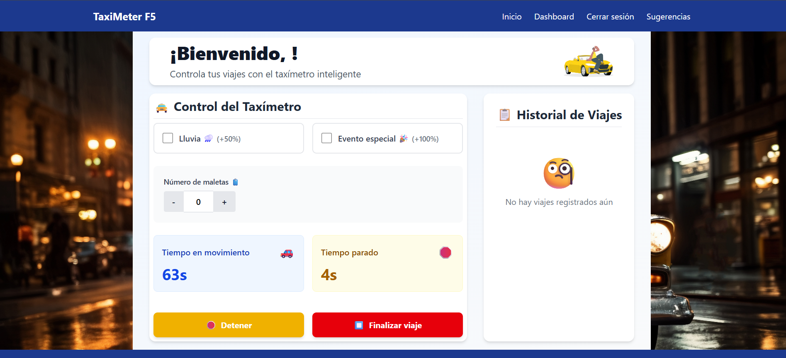

# 🚖 Taxímetro APP
Este proyecto es una aplicación de **taxímetro digital** con interfaz gráfica desarrollada en **Python**. Incluye funcionalidades avanzadas como:

- Registro/Login con contraseñas seguras (`bcrypt`) y tokens JWT
- Cálculo de tarifas dinámicas por franja horaria
- Multiplicadores por condiciones especiales (lluvia, eventos)
- Sistema de logs y almacenamiento histórico de trayectos
- GUI amigable con `Tkinter`
- Preparado para futuro backend/API con Flask o FastAPI

---

## 🖼️ Vista previa

<!-- Reemplaza esta URL con la tuya -->


---

## 🧠 Funcionalidades

### 🔐 Autenticación segura
- Registro e inicio de sesión con contraseñas hasheadas
- Gestión de sesiones con tokens JWT
- Datos de usuario guardados en `auth/users.json`

### 💵 Cálculo inteligente de tarifas
- Tarifa dinámica por franja horaria:
  - 🕖 Mañana (07:00-09:00)
  - 🕔 Tarde (17:00-19:00)
  - 🌙 Nocturna (22:00-05:00)
  - 🕐 Horario normal
- Multiplicadores:
  - 🌧️ Lluvia (x1.2)
  - 🎉 Evento especial (x1.3)

### 🧾 Recibos y registros
- Recibo detallado al finalizar cada trayecto
- Registro histórico de viajes en archivo `history/historico.txt`
- Sistema de logging centralizado en `logs/taximetro.log`

### 🖥️ Interfaz gráfica (Tkinter)
- Pantalla de login y registro
- Panel principal con botones:
  - Iniciar viaje
  - Detener / Mover
  - Finalizar trayecto
- Información visual:
  - Estado actual (detenido / en movimiento)
  - Tarifas aplicadas
  - Tiempo real del trayecto
  - Precio total actualizado

---

## 🛠️ Tecnologías utilizadas

- Python 3.10+
- Tkinter
- `bcrypt` para hashing de contraseñas
- `pyjwt` para gestión de sesiones
- `os`, `logging`, `datetime`, `time` y más

---

## 🚀 Instalación y ejecución

### 🔄 Clonar el repositorio

```bash
https://github.com/Factoria-F5-madrid/proyecto1_YederPimentel.git
cd TaximetroCLI

python -m venv venv
# En Windows
venv\Scripts\activate
# En Mac/Linux
source venv/bin/activate

pip install -r requirements.txt

````

### 📁 Estructura del proyecto

```bash

📁 proyecto/
├── auth/               # Lógica de autenticación y users.json
├── gui/                # Interfaz gráfica con Tkinter
├── logs/               # Archivo taximetro.log
├── history/            # Registro de viajes
├── TaximetroCLI/
│   ├── taximetro.py    # Lógica principal OOP del taxímetro
│   └── main.py         # Entrada principal (CLI + GUI)
└── README.md

```
